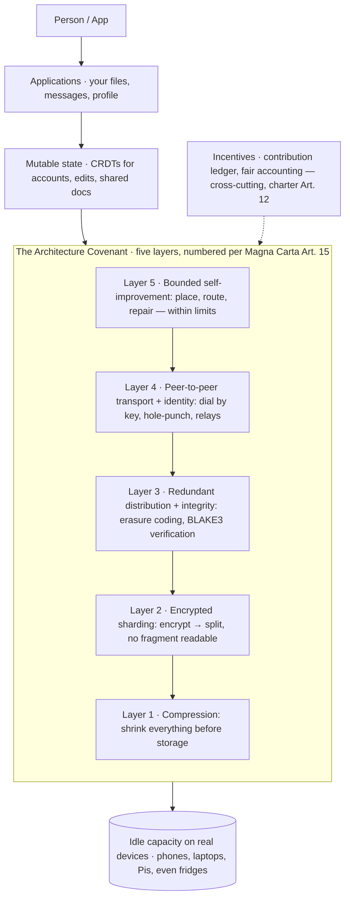
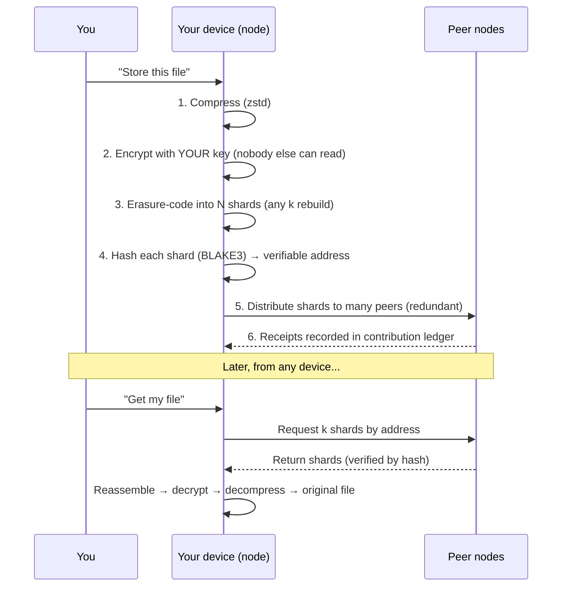

# PiperNet — Envisioning Document
### Designing a real decentralized internet
*Companion to the Technical Bible (research), the Magna Carta (charter), and the working repo (Phase 1 live). This document is the bridge from "what the show meant" to "what we build."*
*Version 1.0 — a living design, amendable by its founder. Present-tense technology claims are attributed to sources; where a claim depends on the current state of a fast-moving field, treat it as a 2026 snapshot to re-check.*

---

## 0. Executive summary

PiperNet is a network that makes servers obsolete. Instead of a person's data living on a company's computer — where it can be read, sold, throttled, or switched off — it lives compressed, encrypted, and split into fragments across ordinary devices, retrievable by its owner from anywhere and readable by no one else. No central owner. No gatekeeper. Self-healing when devices vanish.

Three things make this the right moment to build it, none of which were true when the show aired in 2019:

1. **The hard problem — getting devices to find and reach each other with no server — is now largely solved.** Libraries like iroh (v1.0, June 2026) let a device dial another by its cryptographic key, punch through firewalls directly ~90% of the time, and stay connected as a phone moves between Wi-Fi and cellular. Helia brings the same to browsers with no central certificate authority.
2. **The core storage pattern — encrypted sharding with redundancy — runs in production today** (Storj splits a file into 80+ pieces, any 29 of which rebuild it). We are assembling proven parts, not inventing them.
3. **The network can safely run itself.** Bounded, auditable AI agents now operate real infrastructure — detecting problems, rerouting, self-healing — under human-set limits. That is exactly the "self-improving" PiperNet the charter permits, minus the fictional danger.

The one catastrophe from the show — compression so good it breaks encryption — is fictional physics. Real compression cannot break encryption (encrypted data is indistinguishable from random noise and cannot be compressed). So we build the *full* final vision at full ambition; the monster never comes along, because it was never real.

**Why this matters beyond the tech:** a network that treats a person on a weak signal with a cheap phone as a first-class citizen is public-good infrastructure. Access stops depending on proximity to a data center. That is the thread — from refugee camp to rural clinic to ordinary citizen who simply wants to own their own data — that gives PiperNet a mission a civil servant and a public-health specialist can stand behind, and a market an entrepreneur can build in (decentralized physical infrastructure, "DePIN," is now a recognized and funded category).

**The build path** is a sequence of runnable milestones, each visible and testable, each mapped to the charter: content addressing (done) → encrypted sharding → redundancy/self-healing → a living multi-device network → bounded self-improvement → a fair contribution economy. We are two milestones in. Everything below is how the rest fits together.

---

## A. Canonical PiperNet, distilled

The Technical Bible is the word-by-word reading of all 54 episodes. Here is PiperNet's *design intent*, sorted into three columns so fiction never leaks into engineering.

| Element | Show-canon (what PiperNet was meant to be) | Real-today (the honest analogue) | Our choice |
|---|---|---|---|
| **Middle-out compression** | A magic ratio that makes device-storage viable | Real modern compressors (zstd; format-aware OpenZL; neural codecs) — bounded by entropy | Use best-in-class real compression; treat "middle-out" as *aggressive, format-aware compression*, never magic |
| **Encrypted sharding** (S3E9, the heart) | File → compressed → encrypted → split into meaningless fragments across devices | Exactly how Storj/Sia work: client-side encryption + erasure coding | Build faithfully — this is the core |
| **Redundancy / self-healing** (Melcher test, S4E10) | Lose half the phones, lose no data | Reed-Solomon erasure coding; lazy repair | Build faithfully |
| **Peer-to-peer transport** (patent, S4E4) | Devices find each other, no server | iroh / libp2p — dial by key, hole-punch, relays as fallback | Build faithfully; iroh or Helia |
| **Neural-net optimizer → "Son of Anton"** | Self-optimizing AI that runs the network | Bounded agentic AI for infra ops (real, 2026) | Build the *bounded* version; forbid the unbounded one |
| **Compute credits / PiedPiperCoin** (S5) | Earn credits for contributing; later a coin | DePIN incentive networks (Filecoin/Storj) | Build the honest contribution ledger; token optional & risk-flagged |
| **51% attack / fridge defense** (S5E8) | Majority-of-nodes captures the network; more honest nodes dilute it | Real, well-studied Sybil/51% problem; proof-of-storage + reputation + resource cost | Design anti-capture in from day one |
| **The finale: compression breaks encryption** | The reason PiperNet had to die | **Fictional physics** — impossible with real compression | Excluded by reality, not by us |

**The intent behind the intent.** Read across the columns and PiperNet's *actual* thesis is not "a magic codec." It is: *shift ownership of data from institutions to people, by using idle capacity on devices people already own, protected by cryptography so strong that decentralization doesn't mean exposure.* That thesis is fully buildable today.

---

## B. Reality & state-of-the-art map

For each capability: the fictional version, the best real 2026 technology, what is now *better or newly possible* since 2019, and what remains genuinely hard.

**Compression.** *Fiction:* universal magic ratio. *Real:* Zstandard is the practical default (strong ratio + speed); Meta's OpenZL (2025) adds format-aware, graph-based compression; learned/neural compression is a booming research frontier (JPEG AI standardization; "compression ≈ intelligence"). *Newly better:* neural codecs and format-aware compression push ratios beyond 2019 defaults. *Hard limit:* entropy. Encrypted or already-compressed data is incompressible — so we always **compress before we encrypt**, never after.

**Encrypted sharding & redundancy.** *Fiction:* scrambled fragments no one can read. *Real:* Storj encrypts client-side, erasure-codes into 80+ pieces of which ~29 rebuild the file, and spreads them so no node holds a readable fraction; Filecoin proves storage cryptographically (Proof-of-Replication / Proof-of-Spacetime); Walrus (2D erasure coding "RedStuff," funded at scale in 2025) and Codex (lazy repair, ~1.5–2.5× overhead vs Filecoin's 3–5×) push efficiency. *Newly better:* erasure coding at low overhead is now productized. *Hard:* efficient *repair* (regenerating lost shards without re-downloading everything) and verifying storage without trusting the storer.

**P2P transport & discovery.** *Fiction:* devices magically find each other. *Real:* iroh dials by public key over QUIC, hole-punches direct connections ~90% of the time with stateless relays as fallback, does multipath (survives Wi-Fi↔cellular hand-off), and ships blobs (BLAKE3-verified) and gossip that "scales down to an average phone," with Node/Python/Swift/Kotlin bindings; libp2p/Helia bring browser-to-browser P2P via WebTransport/WebRTC with **no central TLS certificate authority**. *Newly better:* browser P2P without central certs, and key-based dialing, are both post-2019. *Hard:* the ~10% of networks where hole-punching fails still need relays; browsers disappear when a tab closes.

**Identity & encryption.** *Fiction:* barely addressed. *Real:* self-sovereign identity = a keypair; content and connections authenticated by public key (iroh makes the public key the address). *Newly better & important:* NIST finalized post-quantum standards in Aug 2024 — ML-KEM (FIPS 203) for key exchange, ML-DSA/SLH-DSA for signatures — and added HQC as a backup KEM in March 2025; Cloudflare already runs **hybrid classical+post-quantum** key agreement on a large and growing share of live traffic. *Hard:* key management for non-technical people (lose your key, lose your data), and migrating to post-quantum without breaking everything ("harvest now, decrypt later" makes this urgent for data meant to stay secret for years).

**The optimization layer.** *Fiction:* Son of Anton, an AI that runs and improves the network — and, in the finale, goes too far. *Real:* bounded agentic AI now operates production infrastructure — monitoring, anomaly detection, rerouting, self-healing — with *progressive autonomy and safety-bounded authority*, policy-aware automation, approvals, role-based access, and audit logs (Gartner's 2026 I&O guidance; recent research on graduated-trust autonomous network operations). *Newly possible:* this whole category is post-2019. *Hard (and the charter's whole point):* keeping agents inside their bounds — reward misspecification and opaque decisions are real failure modes, so every action must be logged, reversible, and human-goal-bounded.

**Incentives / economy.** *Fiction:* compute credits, then a coin/ICO. *Real:* live DePIN networks pay contributors (Filecoin, Storj); the show's own caution (Hanneman's "1 of 36 ICOs worked") matches reality. *Newly mature:* contribution accounting and proof-of-storage payments are productized. *Hard:* honest accounting without a central referee, and avoiding the speculative-token failure mode.

**Mutable data (the problem the show never mentions).** Content addressing is *immutable* — an address is a fingerprint of exact bytes, so "editing a file" produces a *different* address. But accounts, profiles, and shared documents must change. *Real solution:* Conflict-free Replicated Data Types (CRDTs — Automerge 3.0 cut memory ~10× in 2025; Yjs; Loro) let many devices edit the same data offline and merge automatically with no central server; the pattern is to keep small structural data in the CRDT and store large blobs content-addressed, referenced by hash. Projects like Eidetica already combine CRDT + iroh sync + decentralized identity into a local-first database. *Hard:* conflict semantics beyond simple merges, and pruning history so it doesn't grow forever.

---

## C. The envisioned architecture

### C.1 The layer stack

Layer numbers below follow the **Magna Carta, Article 15** (canonical: 1 = compression … 5 = bounded self-improvement). Concerns the charter's five-layer covenant doesn't enumerate — applications, mutable state, and the incentive ledger — are shown as strata *outside* the numbered covenant so they never collide with the charter's numbering.

The four covenant layers **1–4** (compression, encrypted sharding, redundant distribution, peer-to-peer transport) are the **buildable, safe core** — exactly the charter's Article 16. **Layer 5** is bounded self-improvement. Mutable state and applications sit *above* the covenant; the incentive ledger (Article 12) cross-cuts it. (Compression and encrypted sharding are distinct charter layers — 1 and 2 — even though the code performs them together as "compress → encrypt → split.")

### C.2 Components & flow — storing and retrieving a file

The key property: no single peer ever holds a readable or complete copy, and losing many peers still leaves enough shards to rebuild. This is the Melcher/phone-recall test, made real.

### C.3 Identity & cryptographic model

- **Identity = a keypair.** Each person (and each device) has a cryptographic keypair; the public key is the identity, and in iroh it is literally the network address. No usernames, no central account server, no company that can lock you out.
- **Encryption is client-side and owner-held.** Data is encrypted on your device with your key before it ever leaves. The network stores ciphertext it cannot read (charter Article 3).
- **Future-proofing: hybrid post-quantum.** Following the pattern Cloudflare deploys today, connections and stored-data keys use a **hybrid** of a classical algorithm (e.g., X25519) and a NIST post-quantum standard (ML-KEM). This hedges against both future quantum computers and any weakness in the new algorithms. Because data meant to stay private for years is vulnerable to "harvest now, decrypt later," we prefer post-quantum for at-rest encryption sooner rather than later.
- **The hard human problem — key loss.** If your key is your identity and your decryption power, losing it loses your data. Mitigations to design for (borrowing from real wallets and "credible exit" work): social recovery (trusted contacts hold shards of a recovery key), passphrase-derived keys, and optional encrypted key backup the user controls. *This is a first-class UX problem, not an afterthought — for a public-good network it is the difference between empowerment and a trap.*

### C.4 Mutable data model

Content addressing gives us immutable, verifiable *blobs*. On top, we need things that change. The design:

- **Structural/mutable data → CRDTs** (Automerge or Yjs). Your profile, your file index, a shared document: represented as a CRDT so your phone and laptop (and collaborators) can edit offline and merge automatically, with no server refereeing.
- **Large content → content-addressed shards** (Layers 2–3), referenced *by hash* inside the CRDT. The CRDT holds "file X = hash abc…"; the bytes live in the sharded store. This keeps CRDT history small and lets us deduplicate and garbage-collect blobs independently.
- **Naming.** A stable human-facing name resolves to the latest CRDT state (IPNS-style mutable pointers, or a CRDT-native registry). Signed by your key so no one can hijack your name.

### C.5 The agentic-AI operational layer (bounded)

This is the real, safe "Son of Anton." Its job is to keep the network healthy and fast; its leash is the charter.

**What the agents do (permitted, Article 17):**
- **Observe** via semantic telemetry — rich, contextual signals about node health, shard redundancy, latency, and reachability.
- **Place & rebalance** shards toward a redundancy/latency target.
- **Reroute** around failed or slow nodes.
- **Self-heal** — regenerate lost shards (lazy repair) when redundancy drops.
- **Diagnose & surface** weak spots for human review.

**How they're bounded (Article 18) — this is the design, not a disclaimer:**
- **Progressive autonomy with safety-bounded authority.** Agents earn wider latitude only within pre-set limits; high-impact actions require human approval. (This mirrors current best practice in autonomous network operations.)
- **Policy-aware, with role-based access and audit logs.** Every action is permitted by an explicit policy and written to an immutable log.
- **Reversible by construction.** No action the agent can't retrace and undo.
- **Hard off-ramp.** A human-held stop that is never delegated to the agents and never "optimized away."
- **Forbidden, absolutely:** rewriting their own objectives; changing core protocol rules autonomously; any action that weakens, bypasses, or breaks encryption. (The last is also physically inapplicable to compression — but we forbid it explicitly as defense-in-depth.)

**The stance:** agentic AI *operates* the network; it never *owns* it. Humans govern the governance.

### C.6 Incentive / economic model

- **The honest core: a contribution ledger.** Nodes earn credit for storage and bandwidth they actually provide (proven, not claimed), and spend credit to store and retrieve their own data. This is the show's "compute credits," and the real DePIN model, minus speculation.
- **Proof, not trust.** Contribution is verified with proof-of-storage techniques (proof-of-replication / spacetime) so a node can't get paid for storage it isn't really doing — which also doubles as Sybil defense (below).
- **Tokenization is optional and explicitly risk-flagged.** A tradeable token can bootstrap supply (as Filecoin did) but invites speculation, regulatory exposure, and the "lost my coin on a USB stick" failure. *Founding scope is the ledger; the token is a later, deliberate decision, not a default* (charter Article 12).

### C.7 Node lifecycle & cold-start

- **Joining** is one consent + spare-capacity offer; a new node generates a keypair, announces itself (via relay/discovery), and begins accepting shards.
- **Cold-start is the real challenge** (a P2P network with no nodes is useless — the show hacked it via a mass HooliCon install). Honest strategies: (1) seed with a handful of always-on nodes we run (a "home relay" set, exactly what iroh uses); (2) recruit early contributors around a concrete community (a clinic network, a campus, a co-op); (3) make running a node trivially easy (one click, works on a phone).
- **Health = reachable, serving nodes** (DAU, not installs — the show's own correction). We measure and display this.

### C.8 Resilience: anti-51% / Sybil

The show's central threat is real and named in the literature. Defenses, layered:
- **Resource-cost Sybil resistance.** Influence requires *proven real resources* (storage actually held over time — proof-of-spacetime), so spinning up thousands of fake identities buys nothing without real disks behind them.
- **Reputation & age.** Nodes build trust by reliably serving over time; new/unproven nodes carry less weight in placement and any voting.
- **Redundancy geometry.** Spreading shards across many independent operators and jurisdictions means an attacker must compromise *many* distinct parties to affect any one file (Storj's confidentiality argument).
- **The show's own real lesson:** you defeat a node-share attack by *adding honest capacity* — and any connected device counts (the fridge gag is literally true). More real nodes = more attacker cost.
- **Governance guard (Article 21):** rule changes never ride on a silent automated majority; anti-capture is a standing design concern, not a patch.

### C.9 Privacy & metadata minimization

Encrypting *content* isn't enough; *metadata* (who stores/asks for what, when) can leak. Design commitments (charter Articles 8–9): collect only what the mechanism requires; never put personal data in addresses or query strings; prefer designs where a node can serve a shard without learning who ultimately wants it; and treat "credible exit" (take your data and leave, keys and all) as a shipped feature, not a promise.

### C.10 Governance & credible exit

Founding-era governance is the founder's documented, versioned decisions (charter Article 20), broadening over time and never collapsing into one silent actor or automated majority. **Credible exit** is the anti-lock-in guarantee: your data and identity are yours to export and take elsewhere at any time — the strongest possible check on the network itself.

---

## D. Technology stack

Opinionated choices, with the honest alternative and the tradeoff. **Bold = start here (beginner-buildable core).** *Italic = grow into it (frontier).*

| Layer | Recommended | Credible alternative | Tradeoff / why |
|---|---|---|---|
| Language | **JavaScript / Node.js** | Python; Rust | JS: gentlest on-ramp, best P2P libraries, browser demos you can *see*. Rust (via iroh) is the performance/phone frontier. |
| P2P transport | **Helia + libp2p** to start | **iroh** (grow into) | Helia = all-JS, browser-friendly, great examples. iroh = the most robust device-to-device connections (dial-by-key, multipath), Rust-core with JS bindings. |
| Content addressing | **BLAKE3 / CIDs** | SHA-256 CIDs | BLAKE3 is fast and gives verified streaming (iroh-blobs). Integrity for free. |
| Compression | **Zstandard (zstd)** | *OpenZL; neural codecs* | zstd: excellent ratio+speed, ubiquitous. Format-aware/neural = later gains. Always compress *before* encrypting. |
| Encryption | **libsodium (X25519 + AEAD)** | *Hybrid X25519+ML-KEM* | Start with battle-tested classical; add the post-quantum hybrid as libraries mature (the Cloudflare pattern). |
| Erasure coding | **Reed-Solomon** | *RaptorQ; RedStuff-style 2D* | Reed-Solomon: simple, proven (Storj's 80/29). Fancier codes = better repair efficiency later. |
| Mutable state | **Automerge** | Yjs; Loro | Automerge: JSON-like, clean API, 10× leaner since 2025. Yjs for heavy text; Loro is fast but younger. |
| Identity | **Ed25519 keypairs** | DIDs / verifiable credentials | A keypair is enough to start; formal decentralized-identity standards can layer on. |
| Incentives | **Local contribution ledger** | *Proof-of-storage + optional token* | Start with honest accounting; add cryptographic proofs, then (maybe, deliberately) a token. |
| Agentic ops | **Rules + telemetry** | *ML/LLM agents, bounded* | Start with simple, inspectable rules; graduate to learned agents with progressive, bounded autonomy. |

**Principle (charter Article 6):** never adopt a layer you can't eventually understand. We stand on mature libraries, and replace pieces with our own only where it teaches us something — the hybrid path, which is also how Pied Piper itself operated.

---

## E. Updated implementation & build plan

This table follows the charter's build order (Magna Carta Article 23): bounded self-improvement stays **Phase 5** (locked by Article 23; it never moves). It then extends the plan with three phases the Build Plan doesn't detail, ordered so the *essential* work lands before the *optional* economy: **6 · mutable state & identity**, **7 · post-quantum & privacy hardening**, and **8 · contribution economy (optional)**, kept last. (Per Article 24 the charter governs.) Every phase ships something runnable, has explicit acceptance criteria, maps to the charter, and bakes in the **iterate loop: build → run → measure → learn → adjust → commit → push.** Interruption-proof: each phase is a finished checkpoint.

| Phase | You build | Acceptance test (done = ) | Charter |
|---|---|---|---|
| **0 · Foundations** ✅ | Env, git, first script | A script runs; a commit exists | Art. 6 |
| **1 · One file, two devices** ✅ | Content addressing; 2-node P2P transfer | File crosses between two peers, no server, byte-identical | Art. 1, 7 |
| **2 · Encrypted sharding** ⬅ next | compress → encrypt → split → reassemble | A file becomes N unreadable shards; any single shard is noise; whole rebuilds exactly | Art. 2, 3 |
| **3 · Redundancy & self-healing** | Distribute shards with erasure coding; retrieve with some nodes offline | Kill a chunk of nodes; file still rebuilds; redundancy auto-restores | Art. 4, 13 |
| **4 · A living network** | Multi-node discovery; health dashboard (reachable nodes) | 3+ heterogeneous devices self-organize; you watch nodes join/leave/heal on screen | Art. 11, 14 |
| **5 · Bounded self-improvement** | Telemetry + rules that rebalance/reroute/repair, all logged & reversible, with a stop switch | Knock the network off-balance; it restores toward target *without you*; every action is logged and undoable | Art. 17, 18 |
| **6 · Mutable state & identity** | Keypair identity; a CRDT-backed profile/file-index; naming | Edit your index on two devices offline; they merge with no conflict; name resolves to latest | Art. 2, 7, 9 |
| **7 · Post-quantum & privacy hardening** | Hybrid PQ encryption; metadata minimization; credible-exit export | Data encrypts under hybrid classical+ML-KEM; user can export everything and leave | Art. 8, 9, 18 |
| **8 · Contribution economy** (optional) | Proven contribution ledger | A node earns credit for storage served and spends it to store its own data | Art. 12 |

**The iterate loop, concretely, every phase:** write the smallest version that could work → run it and watch → measure against the acceptance test → note what surprised you → adjust → `git add -A && git commit -m "…" && git push`. Ship rough, learn from reality (the "if you're not embarrassed by v1, you shipped too late" principle the show quotes), refine.

---

## F. The self-improvement engine

"Self-improving" operates at two levels, both bounded.

**The system improves itself** (Layer 5, per charter Article 17): it measures its own health and adapts *within human-set rules* — rebalancing shards, rerouting, restoring redundancy — and every adjustment is logged and reversible. Start with plain rules ("if a file's redundancy drops below k+2, regenerate a shard"); graduate to learned/agentic optimization of *placement and routing* only, with progressive, safety-bounded autonomy. It never touches encryption, never rewrites its own goals, never changes core rules alone.

**The build process improves itself:** each phase's acceptance test is a feedback loop; telemetry from real runs tells us what to build next; the iterate loop turns surprises into the next commit. The network and the plan both get better because we keep measuring and adjusting — the truest sense of "self-improving": an idea, improved into reality, repeatedly.

**Metrics to collect from day one** (they drive both loops): reachable/serving node count (health), per-file redundancy (safety margin), retrieval latency and success rate (experience), repair time after node loss (resilience), and — once there's a ledger — contribution vs. consumption balance (fairness). These are the dials the agents (and we) tune against.

**The agentic role, and its wall:** agents are the network's operators, not its owners. Everything they do is observable, reversible, policy-bounded, and stoppable by a human. That wall is the entire safety story — and, reassuringly, the show's specific catastrophe sits on the far side of a wall that physics already built for us.

---

## G. Viability lens

**Who this is for.**
- *The data-sovereignty user:* anyone who wants to own their files, messages, and identity without a corporate landlord — the mainstream "credible exit" trend (even Bluesky now offers it) shows this demand is real and growing.
- *The public-good / equity segment (the differentiated wedge):* people and institutions in low-connectivity, low-trust, or high-censorship settings — rural clinics, field health programs, community networks, civil-society groups. Extreme compression + offline-tolerant P2P + no central kill-switch is *most* valuable exactly where the current internet serves people *worst*. This is where a civil-servant/public-health founder has unfair insight into real needs.

**The landscape.** Decentralized storage/compute ("DePIN") is a recognized, funded category: Filecoin operates at exabyte scale with cryptographic storage proofs; Storj sells usability-first hot storage; Arweave sells permanence; newer entrants (Walrus, Codex, 0G) push efficiency and AI workloads. PiperNet is not trying to out-crypto them.

**Differentiation & defensibility.** Not "another storage token." PiperNet's edge is **device-first + public-good-first**: designed for phones and weak links (not data-center-grade providers), with an explicit equity mission and credible-exit guarantees. Defensibility comes less from a patent and more from (1) the community and trust built in an underserved niche, (2) genuine device-side engineering (compression + offline tolerance) that general storage networks don't optimize for, and (3) mission alignment that attracts contributors and institutional partners a pure-profit network can't.

**Top risks & mitigations.**
- *Cold-start* (no nodes = no network) → seed nodes + a concrete launch community + one-click node.
- *Key loss locks users out* → social recovery and controlled key backup as first-class features.
- *Regulatory exposure* (if a token appears) → keep the founding economy a non-tradeable ledger; treat any token as a deliberate, advised, later decision.
- *Abuse / illegal content on a censorship-resistant network* → design for encrypted-by-default (operators can't see content), clear norms, and node-operator controls, and think through this honestly before scale, not after.
- *Complexity outruns a solo newcomer* → the phased plan; stand on libraries; each phase shippable alone.

**Minimal path to one real user deriving real value.** The whole point of the phased build: by Phase 6 you have identity + mutable state + redundant encrypted storage across a few devices. The first real use case is small and honest — *"back up and sync my own files across my own devices, encrypted, with no cloud account."* One person, real value, no server. That's the seed from which a network grows; everything after is more nodes and more uses.

---

## H. Open questions / next decisions

1. **Transport choice for the real network:** stay on Helia (all-JS, simplest) or adopt iroh (most robust, adds a Rust dependency) at Phase 4? *Leaning: prototype on Helia, evaluate iroh at Phase 4.*
2. **Erasure-coding parameters:** what N and k (redundancy vs. overhead)? *Start Storj-like; tune with Phase 3 measurements.*
3. **CRDT choice:** Automerge (clean JSON) vs. Yjs (text-heavy) for Phase 6. *Leaning Automerge.*
4. **When (if ever) to add a token** — deliberately deferred; revisit only with real network traction.
5. **The abuse/content-moderation stance** on an encrypted, censorship-resistant network — needs a thought-through position before Phase 4 scale.
6. **Post-quantum timing:** how soon to move at-rest encryption to hybrid PQ, given "harvest now, decrypt later." *Leaning: design keys PQ-ready now, switch on by Phase 7.*

**Essential vs. aspirational:** Phases 2–4 (encrypted sharding, redundancy, a living network) together with Phase 6 (mutable state & identity) are *essential* — they are PiperNet. Phase 5 (bounded self-improvement) is the charter's signature capability and high-value. Phases 7 and 8 (post-quantum hardening, then the optional economy) are important but can follow real usage. The agentic and token layers are where ambition must stay disciplined by the charter. *(Ordering note: the essential identity & mutable-state work is Phase 6, deliberately placed before the optional economy at Phase 8; self-improvement stays Phase 5, locked by Magna Carta Article 23.)*

*Next action: build Phase 2 — encrypted sharding — and commit it. The design above is the map; the repo is the territory.*
